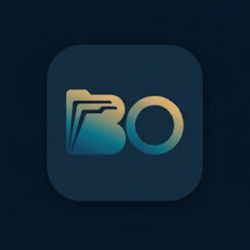

<p align="center">
  
</p>

<h1 align="center">BassOrder</h1>

<p align="center">
  <em>From trash playlists to genre mastery.</em><br />
  Sort by genre — <strong>Spotify</strong> and <strong>local library</strong>, two independent modules.
</p>

<p align="center">
  <sub>FR · Des playlists poubelle à la maîtrise du tri.</sub>
</p>

**Download (Windows)**: [bassorder.smegg.cloud](https://bassorder.smegg.cloud)  
**Cloud API**: [api.bassorder.smegg.cloud](https://api.bassorder.smegg.cloud) · `GET /health`  
**Stack**: Tauri 2 + React + TypeScript + Vite · local SQLite · self-hosted Rust API (Axum)

## Install the app

1. Open [bassorder.smegg.cloud](https://bassorder.smegg.cloud) and download the `.msi` installer.
2. Launch BassOrder.
3. (Optional) **Account** rail → connect to the cloud; the default production API URL is `https://api.bassorder.smegg.cloud`.

## Dev (Windows / PowerShell)

```bash
cd C:\Users\eliot\Documents\travail\BassOrder
pnpm install
pnpm tauri dev
```

Copy `.env.example` to `.env` and paste the BassOrder Spotify **Client ID** (`VITE_SPOTIFY_CLIENT_ID`) so the app can show a single **Connect to Spotify** button. Redirect URIs on the Spotify dashboard: `http://127.0.0.1:41821/callback` and `http://127.0.0.1:41822/callback`.

UI only (browser, no Tauri SQLite):

```bash
pnpm dev
```

Local API:

```bash
pnpm api
# http://127.0.0.1:8787
```

Build installer:

```bash
# Prod API URL baked into the frontend:
# $env:VITE_BASSORDER_API="https://api.bassorder.smegg.cloud"
pnpm tauri build
```

Artifacts: `src-tauri/target/release/bundle/`.

## Modules

| Module | Role |
|--------|------|
| Spotify | OAuth → analysis → playlists by genre |
| Local | PC folder → tags → preview → copy or move by genre |

The **Local** module needs the Tauri window. By default files are **copied** into subfolders (Rock, Jazz, Uncategorized…).

## Local database

Everything is stored in a SQLite file:

`%APPDATA%\com.eliot.bassorder\bassorder.db`

Settings → **Open database folder**.

## Account & cloud API

- **Account** rail: cloud login (email), local PIN, favorites / presets, **Sync knowledge** (mirror + pool).
- Self-host: [`server/`](server/) — details in [`server/README.md`](server/README.md).
- VPS deploy: [`deploy/`](deploy/) (`docker compose`, Nginx, Certbot).

```bash
# Frontend build variable
VITE_BASSORDER_API=https://api.bassorder.smegg.cloud
```

## License & legal

- Code: [MIT License](LICENSE) — © 2026 Eliot GIRAUD
- Security: [SECURITY.md](SECURITY.md)
- Site: [Privacy](https://bassorder.smegg.cloud/privacy.html) · [Terms](https://bassorder.smegg.cloud/terms.html) · [Legal notice](https://bassorder.smegg.cloud/mentions.html)

Software provided “as is”, without warranty. Not affiliated with Spotify.
