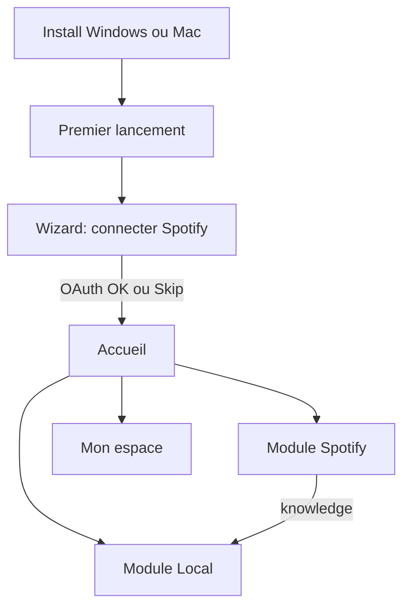

# Méga-plan — Parcours utilisateur, profils & Mac

Statut : **décisions produit verrouillées** (2026-08-21).  
Prochaine étape : implémentation par phases.

## Décisions verrouillées

| Sujet | Décision |
|---|---|
| Utilisateurs machine | **Un seul utilisateur par install** — plus de gate Netflix multi-pseudos |
| Premier parcours | **Spotify d’abord** (élargir le dictionnaire + pool cloud si sync) |
| Local dès le début | **Oui, accessible** (pas bloqué) — pour scanner / voir l’évolution sans attendre Spotify |
| macOS | **Oui** — via CI GitHub Actions (pas besoin de Mac perso au quotidien) |
| Linux | Plus tard (pas prioritaire) |

---

## Diagnostic (rappel)

Aujourd’hui : plusieurs « moi » (espace local, PIN, N comptes Spotify, cloud, presets) + pas d’onboarding.  
Cible : un mental model **une personne · un compte Spotify · cloud optionnel · local toujours là**.

---

## Architecture UX cible

### Vocabulaire

| Ancien | Nouveau |
|---|---|
| Profils / Qui écoute / Session BassOrder | **Toi** / **Mon espace** (un seul) |
| Profils Spotify (bulles) | **Compte Spotify** (1 par défaut ; multi = Avancé) |
| Page Compte + Page Profil | **Une seule page : Mon espace** |
| Gate multi-users | **Supprimée** (ou réduite à PIN si défini) |

### Wizard (max 3 écrans)

1. Bienvenue BassOrder  
2. **Connecter Spotify** (CTA principal) + lien secondaire « Plus tard »  
3. Optionnel : PIN / cloud (skippable) → Accueil  

Sur l’accueil : Spotify mis en avant, **Mes fichiers** visible dès le jour 1.

### Mon espace (fusion)

- Identité locale unique (pseudo, avatar, couleur)  
- PIN optionnel  
- Compte cloud optionnel (replié)  
- Compte Spotify (lien / déconnexion)  
- Plus de switch user / créer un 2ᵉ profil machine  

### Données

- Migration : si plusieurs `users` en SQLite → garder le **dernier actif** (ou le plus récent), archiver/ignorer les autres avec message one-shot.  
- Scope data reste `user_id` unique en interne (pas de refonte DB profonde).

---

## macOS — chemin simple

Tauri 2 build déjà le `.app` / `.dmg` **sur un runner macOS**.

### Approche retenue (peu de friction)

1. **GitHub Actions** `macos-latest` sur tag / release  
2. Artefacts : `.dmg` (+ `.app` zip si besoin)  
3. Upload vers :
   - GitHub Release  
   - `/var/www/bassorder/downloads/` sur le VPS  
4. Landing : bouton **Télécharger pour Mac** dès qu’un artefact existe  

### Complexité / pièges (honnêtes)

| Point | Impact |
|---|---|
| Build CI macOS | **Facile** — workflow standard Tauri |
| Signature Apple (`Developer ID`) | **Optionnel au début** — sans signature : Gatekeeper avertit (« app non vérifiée ») ; OK pour beta / école |
| Notarisation | Plus tard si tu veux zéro friction Mac grand public |
| Apple Silicon vs Intel | `universal` ou arm64-first ; documenter sur la landing |

**Verdict** : on peut livrer un Mac **non signé** vite ; signature = étape 2 si besoin.

### Workflow prévu

Fichier `/.github/workflows/release.yml` :
- trigger : `v*` tags  
- jobs : `windows` (déjà local) + `macos`  
- publish release assets  

---

## Phases d’implémentation

| Phase | Contenu | Effort | Statut |
|---|---|---|---|
| **P0** | Copy / rename UI (Espace, Compte Spotify) | S | à faire |
| **P1** | Single-user : retirer gate multi + migration last-user | M | **fait** |
| **P2** | Wizard Spotify-first + Local accessible | M | à faire |
| **P3** | Fusion Profil+Compte → Mon espace | M | à faire |
| **P4** | Spotify 1 compte défaut ; multi en Avancé | S–M | à faire |
| **P5** | CI macOS + landing Mac + upload VPS | M | **CI faite** (unsigned) ; artefacts via Actions |
| **P6** | Empty states / tooltips parcours | S | à faire |

---

## Critères de succès

- Nouveau user : Spotify connecté (ou skip) en **&lt; 2 min** sans lire de doc  
- Zéro écran « Qui écoute ? » multi-cartes  
- Dictionnaire grossit via Spotify ; Local utilisable immédiatement  
- Landing : Windows + Mac avec liens réels  

## Hors scope (plus tard)

- Linux  
- Signature / notarisation Apple payante  
- Refonte totale du Client ID Spotify Developer (peut s’insérer en P4 si on a une app Spotify partagée)
