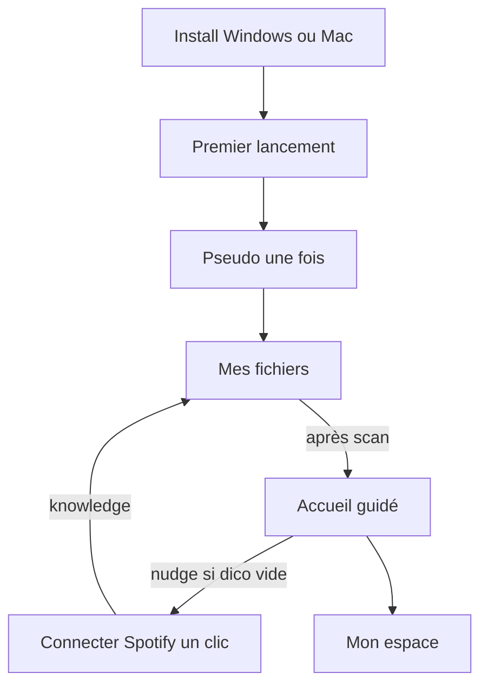

# Méga-plan — Parcours utilisateur, profils & Mac

Statut : **décisions produit mises à jour** (2026-08-25).  
Parcours premier user : **dossier d’abord**, Spotify en un clic ensuite.

## Décisions verrouillées

| Sujet | Décision |
|---|---|
| Utilisateurs machine | **Un seul utilisateur par install** — plus de gate Netflix multi-pseudos |
| Premier parcours | **Dossier d’abord** (Mes fichiers) — Spotify ensuite pour enrichir le dictionnaire |
| Local dès le début | **Oui** — atterrissage J1, CTA dans l’empty state |
| Spotify | **Un bouton « Se connecter »** (Client ID bundle) ; checklist / multi-comptes en Avancé |
| macOS | **Oui** — via CI GitHub Actions (pas besoin de Mac perso au quotidien) |
| Linux | Plus tard (pas prioritaire) |

---

## Diagnostic (rappel)

Avant : pas d’onboarding, accueil à 2 cartes égales, Spotify bloqué par un setup Developer (Client ID).  
Cible : **une personne · un dossier dès J1 · un compte Spotify en un clic · cloud optionnel**.

---

## Architecture UX cible

### Vocabulaire

| Ancien | Nouveau |
|---|---|
| Profils / Qui écoute / Session BassOrder | **Toi** / **Mon espace** (un seul) |
| Profils Spotify (bulles) | **Compte Spotify** (1 par défaut ; multi = Avancé) |
| Page Compte + Page Profil | **Une seule page : Mon espace** |
| Gate multi-users | **Supprimée** (ou réduite à PIN si défini) |

### Premier lancement

1. Gate : pseudo + couleur (une fois)  
2. Atterrissage **Mes fichiers** — CTA **Choisir un dossier** dans l’empty  
3. Après scan : accueil guidé (une étape recommandée) + nudge Spotify si pas encore connecté  
4. Spotify : bouton unique (OAuth PKCE). Client ID perso / multi-comptes dans **Avancé**

Rail : historiques masqués tant qu’ils sont vides.

### Mon espace (fusion)

- Identité locale unique (pseudo, avatar, couleur)  
- PIN optionnel  
- Compte cloud optionnel (replié)  
- Compte Spotify (lien / déconnexion)  
- Plus de switch user / créer un 2ᵉ profil machine  

### Spotify — app partagée

- Client ID lu depuis `VITE_SPOTIFY_CLIENT_ID` (`.env` local, secret CI)  
- Redirect URI : `http://127.0.0.1:41821/callback` et `http://127.0.0.1:41822/callback`  
- Mode Development Spotify : ~25 comptes dans User Management jusqu’à Quota Extension  

### Données

- Migration : si plusieurs `users` en SQLite → garder le **dernier actif** (ou le plus récent), archiver/ignorer les autres avec message one-shot.  
- Scope data reste `user_id` unique en interne (pas de refonte DB profonde).

---

## macOS — chemin simple

Tauri 2 build déjà le `.app` / `.dmg` **sur un runner macOS**.

### Approche retenue (peu de friction)

1. **GitHub Actions** `macos-latest` sur tag / release  
2. Artefacts : `.dmg` (+ `.app` zip si besoin)  
3. Upload vers :
   - GitHub Release  
   - `/var/www/bassorder/downloads/` sur le VPS  
4. Landing : bouton **Télécharger pour Mac** dès qu’un artefact existe  

### Complexité / pièges (honnêtes)

| Point | Impact |
|---|---|
| Build CI macOS | **Facile** — workflow standard Tauri |
| Signature Apple (`Developer ID`) | **Optionnel au début** — sans signature : Gatekeeper avertit (« app non vérifiée ») ; OK pour beta / école |
| Notarisation | Plus tard si tu veux zéro friction Mac grand public |
| Apple Silicon vs Intel | `universal` ou arm64-first ; documenter sur la landing |

**Verdict** : on peut livrer un Mac **non signé** vite ; signature = étape 2 si besoin.

### Workflow prévu

Fichier `/.github/workflows/release.yml` :
- trigger : `v*` tags  
- jobs : `windows` (déjà local) + `macos`  
- publish release assets  
- secret `VITE_SPOTIFY_CLIENT_ID` pour le bouton unique dans les installers  

---

## Phases d’implémentation

| Phase | Contenu | Effort | Statut |
|---|---|---|---|
| **P0** | Copy / rename UI (Espace, Compte Spotify) | S | partiel (Mon espace) |
| **P1** | Single-user : retirer gate multi + migration last-user | M | **fait** |
| **P2** | First-run Local + accueil guidé | M | **fait** |
| **P3** | Fusion Profil+Compte → Mon espace | M | **fait** |
| **P4** | Spotify 1 clic (ID bundle) ; multi en Avancé | S–M | **fait** |
| **P5** | CI macOS + landing Mac + upload VPS | M | **CI faite** (unsigned) ; artefacts via Actions |
| **P6** | Empty states / nudge parcours | S | **fait** (Local CTA + nudge Spotify) |

---

## Critères de succès

- Nouveau user : dossier choisi en **&lt; 2 min** sans lire de doc  
- Spotify : un bouton, pas de Client ID à coller (si `.env` / secret CI renseigné)  
- Zéro écran « Qui écoute ? » multi-cartes  
- Dictionnaire grossit via Spotify ; Local utilisable immédiatement  
- Landing : Windows + Mac avec liens réels  

## Hors scope (plus tard)

- Linux  
- Signature / notarisation Apple payante  
- Quota Extension Spotify (démarche dashboard, pas du code)
